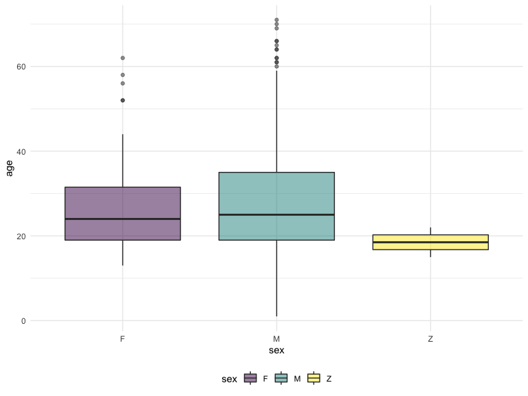
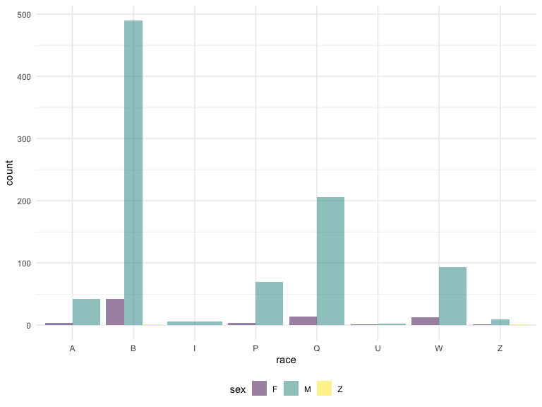

Group 13 Final Project
================
cs3779, kd2640, ob2305, mp3745, lef2147
2019-11-18

Read in and tidy the data

Things to do:

  - ~~Read in data~~
  - ~~Subsample rows~~
  - ~~Select columns that we want~~
  - ~~Combine height into one column~~
  - Make sure columns are right data type
  - Rename columns to be more informative
  - Recode columns to be more informative
  - Format date, time
  - Check for missing

<!-- end list -->

``` r
# Read in data
stop_frisk_df = 
  GET("https://www1.nyc.gov/assets/nypd/downloads/excel/analysis_and_planning/stop-question-frisk/sqf-2016.csv") %>% 
  content("parsed") 
```

``` r
# Subsample data to speed up calculation time
# Select columns we want
# Combine height into one column
stop_frisk_tidy_df =
  stop_frisk_df %>% 
  sample_n(1000) %>% 
  select(pct, datestop, timestop, inout, perobs, perstop, arstmade, offunif, frisked, searched, rf_vcrim, rf_othsw, rf_attir:ac_evasv, cs_furtv:cs_other, rf_knowl, sb_hdobj:sb_admis, rf_furt, rf_bulg, sex, race, age:othfeatr, city, xcoord, ycoord) %>% 
  mutate(
    height_inch = ht_feet * 12 + ht_inch
  )
```

``` r
# count per sex group
demographics = stop_frisk_tidy_df %>% 
  select(sex:build) %>% 
  mutate(age = as.numeric(age)) 

# count subjects by sex
demographics %>% 
  group_by(sex) %>% 
  summarize (count = n()) %>% 
  knitr::kable()
```

| sex | count |
| :-- | ----: |
| F   |    84 |
| M   |   909 |
| Z   |     7 |

``` r
# distribution of age by sex
demographics %>% 
  ggplot(aes(x = sex, y = age, fill = sex))+
  geom_boxplot(alpha = .5)
```



``` r
# subjects count by race and sex 
demographics %>% 
  ggplot(aes(x = race, fill = sex))+
  geom_bar(alpha = .5, position = "dodge")
```


