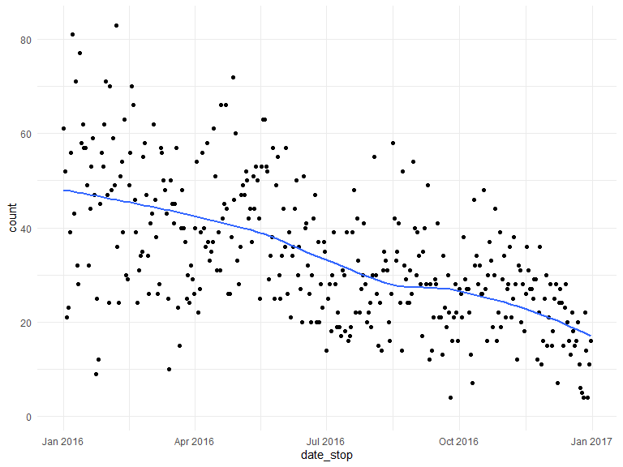
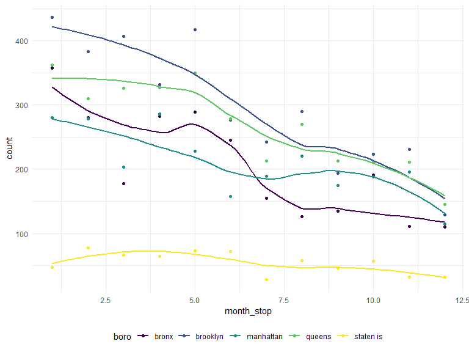
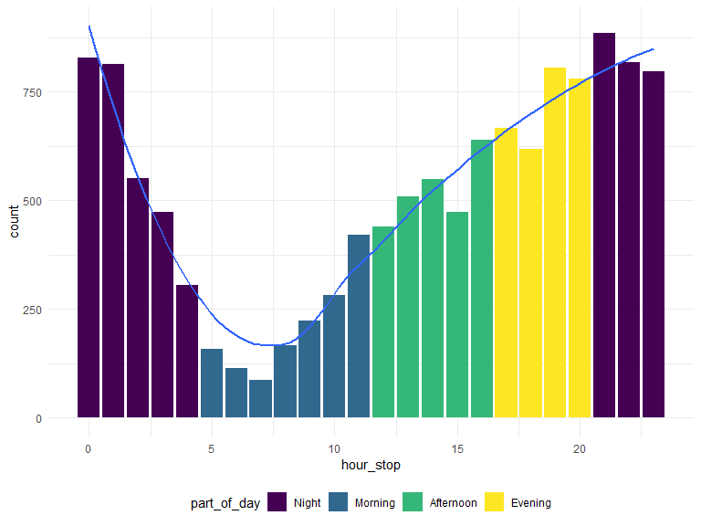
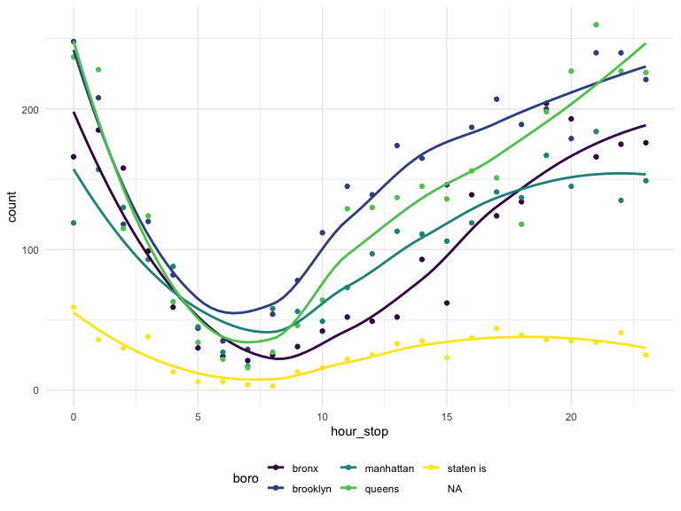
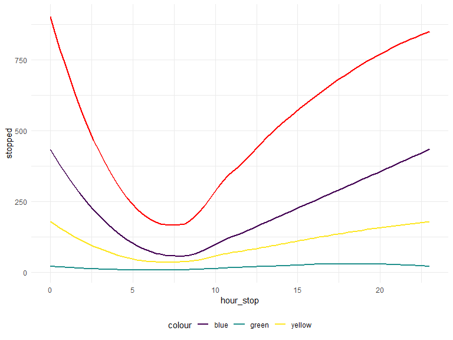

Group 13 Final Project
================
cs3779, kd2640, ob2305, mp3745, lef2147
2019-11-21

Rough Outline of Project:

  - Describe the goal/motivation of the project; have some stats and
    facts to explain our purpose in investigating this dataset
  - Describe the dataset: where is it from, what does it contain
  - Review the questions we intend on answering
  - Exploratory Data Analysis
      - Give an overview of the demographics of our dataset, any
        conclusion we make is only relevant to those who were stopped
        which is why it is good to give an idea of who is represented
          - histogram of race/build/etc.
          - distribution of continuous variables
      - Logistic Regression
          - odds of frisked
          - odds of arrest
      - Trends over time
          - could maybe find a way to test this, i.e. linear regression,
            is the slope equal to zero, or something of that nature. the
            plot shows a funnel pattern so maybe we could look into that
            more
      - other things
  - Findings/Discussion

Read in and tidy the data

The following code:

  - Reads in the data
  - Renames columns to be more informative
  - Combines height columns into a single height in inches
  - Converts date\_stop to date data type
  - Converts time\_stop to time data type
  - Recodes the values in categorical columns to be more informative
  - Selects column subset for further analysis

<!-- end list -->

``` r
# Read in data
stop_frisk_df = 
  # Read in data from internet
  GET("https://www1.nyc.gov/assets/nypd/downloads/excel/analysis_and_planning/stop-question-frisk/sqf-2016.csv") %>% 
  content("parsed") %>% 
  
  # Clean and fix names of columns
  janitor::clean_names() %>% 
  rename(
    precinct = pct,
    date_stop = datestop,
    time_stop = timestop,
    stop_in_out = inout,
    obs_time_min = perobs,
    stop_time_min = perstop,
    arst_made = arstmade,
    off_in_unif = offunif,
    hair_col = haircolr,
    eye_col = eyecolor,
    other_feature = othfeatr,
    boro = city
  )  %>% 
  mutate(
    # Combine height columns
    height_inch = ht_feet * 12 + ht_inch,
    # Convert date to proper format
    date_stop = mdy(date_stop),
    # Convert time to proper format
    time_stop = hm(time_stop / 100),
    # Recode to be more informative
    stop_in_out = recode(stop_in_out, "I" = "inside", "O" = "outside"),
    race = recode(
      race, 
      "A" = "asian/pacific islander", 
      "B" = "black", 
      "I" = "american indian/alaska native",
      "P" = "black-hispanic",
      "Q" = "white-hispanic",
      "W" = "white",
      "U" = "unknown",
      "Z" = "other"
    ),
    hair_col = recode(
      hair_col,
      "BA" = "bald",
      "BK" = "black",
      "BL" = "blond",
      "BR" = "brown",
      "DY" = "dyed",
      "FR" = "frosted",
      "GY" = "gray",
      "RA" = "red",
      "SN" = "sandy",
      "SP" = "salt and pepper",
      "WH" = "white",
      "XX" = "unknown",
      "ZZ" = "other",
    ),
    eye_col = recode(
      eye_col,
      "BK" = "black",
      "BL" = "blue",
      "BR" = "brown",
      "DF" = "different",
      "GR" = "green",
      "GY" = "gray",
      "HA" = "hazel",
      "MA" = "maroon",
      "PK" = "pink",
      "VI" = "violet",
      "XX" = "unknown",
      "Z" = "other",      
    ),
    build = recode(
      build,
      "H" = "heavy",
      "M" = "medium",
      "T" = "thin",
      "U" = "muscular",
      "Z" = "unknown"
    ),
    # change boro columns to lowercase for consistency
    boro = tolower(boro),
    # change character datatypes to numeric
    age = as.numeric(age),
    obs_time_min = as.numeric(obs_time_min),
    stop_time_min = as.numeric(stop_time_min)
  )  %>% 
  # select columns for further analysis
  select(precinct, date_stop, time_stop, stop_in_out, obs_time_min, stop_time_min, arst_made, off_in_unif, frisked, 
         searched, rf_vcrim, rf_othsw, rf_attir:ac_evasv, cs_furtv:cs_other, rf_knowl, sb_hdobj:sb_admis, rf_furt, 
         rf_bulg, sex, race, age, height_inch, weight:other_feature, boro, xcoord, ycoord) %>% 
  # change all columns that have Y/N to 1/0
  mutate_at(vars(arst_made:rf_bulg), funs(recode(., "Y" = "1", "N" = "0"))) %>% 
  # change binary columns to numeric instead of character
  mutate_at(vars(arst_made:rf_bulg), funs(as.numeric(.))) %>% 
  # converts all character variables to factors (this does the same as the for loop)
  mutate_if(is.character, as.factor)
```

Evaluating Missing Data and Categorical Data

``` r
table(stop_frisk_df$race)
```

    ## 
    ## american indian/alaska native        asian/pacific islander 
    ##                            38                           737 
    ##                         black                black-hispanic 
    ##                          6498                           873 
    ##                         other                       unknown 
    ##                           140                            95 
    ##                         white                white-hispanic 
    ##                          1270                          2753

``` r
table(stop_frisk_df$hair_col)
```

    ## 
    ##            bald           black           blond           brown 
    ##             391            9046             143            2323 
    ##            dyed            gray           other             red 
    ##               4             125              59              39 
    ## salt and pepper           sandy         unknown 
    ##              74               2             198

``` r
table(stop_frisk_df$eye_col)
```

    ## 
    ##     black      blue     brown different      gray     green     hazel 
    ##       955       206     10839         1        14       103       113 
    ##     other   unknown 
    ##        54       119

``` r
table(stop_frisk_df$build)
```

    ## 
    ##    heavy   medium muscular     thin  unknown 
    ##     1209     5470      133     5382      210

``` r
# we should consider consolidating categories

colSums(is.na(stop_frisk_df))
```

    ##      precinct     date_stop     time_stop   stop_in_out  obs_time_min 
    ##             1             1             1             1             1 
    ## stop_time_min     arst_made   off_in_unif       frisked      searched 
    ##            24             1             1             1             1 
    ##      rf_vcrim      rf_othsw      rf_attir      cs_objcs      cs_descr 
    ##             1             1             1             1             1 
    ##      cs_casng      cs_lkout      rf_vcact      cs_cloth      cs_drgtr 
    ##             1             1             1             1             1 
    ##      ac_evasv      cs_furtv      rf_rfcmp      ac_cgdir      rf_verbl 
    ##             1             1             1             1             1 
    ##      cs_vcrim      cs_bulge      cs_other      rf_knowl      sb_hdobj 
    ##             1             1             1             1             1 
    ##      sb_outln      sb_admis       rf_furt       rf_bulg           sex 
    ##             1             1             1             1             1 
    ##          race           age   height_inch        weight      hair_col 
    ##             1            35             1             1             1 
    ##       eye_col         build other_feature          boro        xcoord 
    ##             1             1         11637             1           352 
    ##        ycoord 
    ##           352

``` r
# we should consider removing variable other_feature (11637 missing obs)
# age has 35 missing values, consider multiple imputation methods here

# Looks like there is also an entire row of NA's
```

Looking at stops over time

  - Over a year
  - By time of day

<!-- end list -->

``` r
# Number of stops per day
stop_frisk_df %>% 
  group_by(date_stop) %>% 
  summarize(
    count = n()
  ) %>% 
  ggplot(aes(x = date_stop, y = count)) + 
  geom_point() +
  geom_smooth(se = FALSE)
```



``` r
# Number of stops per month
stop_frisk_df %>% 
  mutate(
    month_stop = factor(month(date_stop))
  ) %>% 
  filter(
    month_stop != is_null(month_stop)
  ) %>% 
  group_by(month_stop) %>% 
  summarize(
    count = n()
  ) %>% 
  ggplot(aes(x = month_stop, y = count)) + 
  geom_bar(stat = "Identity") 
```


``` r
# Number of stops per day (broken down by boro)
stop_frisk_df %>% 
  mutate(
    month_stop = month(date_stop)
  ) %>% 
  filter(
    month_stop != is_null(month_stop)
  ) %>%   
  group_by(month_stop, boro) %>% 
  summarize(
    count = n()
  ) %>% 
  ggplot(aes(x = month_stop, y = count, color = boro)) + 
  geom_point() +
  geom_smooth(se = FALSE) 
```



``` r
# Number of stops per hour over the day
stop_frisk_df %>% 
  mutate(
    hour_stop = hour(time_stop),
    part_of_day = cut(hour_stop, breaks = c(0, 5, 12, 17, 21, 24), labels = c("Night", "Morning", "Afternoon", "Evening", "Night"), right = FALSE)
  ) %>% 
  select(hour_stop, part_of_day) %>% 
  group_by(hour_stop, part_of_day) %>% 
  summarize(
    count = n()
  ) %>% 
  ggplot(aes(x = hour_stop, y = count)) + 
  geom_bar(stat = "Identity", aes(fill = part_of_day)) +
  geom_smooth(se = FALSE)
```



``` r
# Number of stops per hour over the day (broken down by boro)
stop_frisk_df %>% 
  mutate(
    hour_stop = hour(time_stop)
  ) %>% 
  group_by(hour_stop, boro) %>% 
  summarize(
    count = n()
  ) %>% 
  ggplot(aes(x = hour_stop, y = count, color = boro)) + 
  geom_point() +
  geom_smooth(se = FALSE)
```



This code chunk looks at the number of people stopped, frisked, frisked
& searched, and searched over a single day

``` r
stop_frisk_df %>% 
  filter(date_stop != is.na(date_stop)) %>% 
  mutate(
    hour_stop = hour(time_stop)
  ) %>% 
  group_by(hour_stop, frisked, searched) %>% 
  summarize(
    count = n()
  ) %>% 
  pivot_wider(
    names_from = frisked:searched,
    values_from = count
  ) %>% 
  rename(
    "stopped" = "0_0",
    "frisked" = "1_0",
    "searched" = "0_1",
    "frisk_and_search" = "1_1"
  ) %>% 
  mutate(
    searched = replace_na(searched, 0),
    stopped = replace_na(stopped, 0),
    frisked = replace_na(frisked, 0),
    frisk_and_search = replace_na(frisk_and_search, 0),
    stopped = stopped + searched + frisked + frisk_and_search
  ) %>% 
  ggplot(aes(x = hour_stop, y = stopped)) +
  geom_smooth(se = FALSE, color = 'red') +
  geom_smooth(aes(y = frisked, color = 'blue'), se = FALSE) +
  geom_smooth(aes(y = searched, color = 'green'), se = FALSE) +
  geom_smooth(aes(y = frisk_and_search, color = 'yellow'), se = FALSE) 
```



Logistic Regression Dataset - not sure if we want to use this for
overall but didnt want to completely change the code above without
asking everyone

``` r
stop_frisk_log = stop_frisk_df %>% mutate(
    race = recode(
      race, 
      "asian/pacific islander" = "other", 
      "black" = "black", 
      "american indian/alaska native" = "other",
      "black-hispanic" = "black-hispanic",
      "white-hispanic" = "white-hispanic",
      "white" = "white",
      "unknown" = "other",
      "other" = "other"
    ),
    hair_col = recode(
      hair_col,
      "dyed" = "other",
      "frosted" = "other",
      "gray" = "other",
      "red" = "other",
      "sandy" = "other",
      "salt and pepper" = "other",
      "white" = "other",
      "unknown" = "other",
      "ZZ" = "other"
    ),
    eye_col = recode(
      eye_col,
      "different" = "other",
      "green" = "other",
      "gray" = "other",
      "hazel" = "other",
      "maroon" = "other",
      "pink" = "other",
      "violet" = "other",
      "unknown" = "other"
    ),
    build = recode(
      build,
      "muscular" = "other",
    ))
```

Building a model using only characteristics, demographics, and location
as predictors for frisked - assess multicolinearity to determine if
there are any variables that exhibit high correlation - We will remove
any variables that exhibit signs of multicollinearity - From this model,
we can assess of those who were stopped, what are the odds of getting
frisked based on certain characteristics, demographics and location
predictors - IMPORTANT: we cannot make any causal statements from this
model ‘i.e. you have a higher odds of getting stopped if you are X race’
because everyone in this dataset was
stopped

``` r
model_1 = glm(frisked ~ sex + race + age + height_inch + weight + hair_col + eye_col + boro + build + stop_in_out + precinct + off_in_unif, family = binomial, data = stop_frisk_log)

#car::vif(model_1)
# Based on the GVIF, we will remove boro

model_2 = glm(frisked ~ sex + race + age + height_inch + weight + hair_col + eye_col + build + stop_in_out + precinct + off_in_unif, family = binomial, data = stop_frisk_log)

#car::vif(model_2)
# no more collinearity problems

summary(model_2)
```

    ## 
    ## Call:
    ## glm(formula = frisked ~ sex + race + age + height_inch + weight + 
    ##     hair_col + eye_col + build + stop_in_out + precinct + off_in_unif, 
    ##     family = binomial, data = stop_frisk_log)
    ## 
    ## Deviance Residuals: 
    ##     Min       1Q   Median       3Q      Max  
    ## -2.0482  -1.2804   0.7371   0.9372   1.9748  
    ## 
    ## Coefficients:
    ##                      Estimate Std. Error z value Pr(>|z|)    
    ## (Intercept)        -1.7286908  0.4367304  -3.958 7.55e-05 ***
    ## sexM                0.8342144  0.0775060  10.763  < 2e-16 ***
    ## sexZ                0.6674880  0.2875712   2.321 0.020280 *  
    ## raceblack           0.4450129  0.0739403   6.019 1.76e-09 ***
    ## raceblack-hispanic  0.4535358  0.1011500   4.484 7.33e-06 ***
    ## racewhite          -0.0454750  0.0932264  -0.488 0.625698    
    ## racewhite-hispanic  0.4371895  0.0798993   5.472 4.46e-08 ***
    ## age                -0.0108360  0.0017841  -6.074 1.25e-09 ***
    ## height_inch         0.0274359  0.0064336   4.264 2.00e-05 ***
    ## weight              0.0004723  0.0006257   0.755 0.450349    
    ## hair_colblack       0.1138623  0.1116728   1.020 0.307915    
    ## hair_colblond      -0.2342093  0.2132065  -1.099 0.271982    
    ## hair_colbrown      -0.0075590  0.1183843  -0.064 0.949089    
    ## hair_colother      -0.0427759  0.1417515  -0.302 0.762830    
    ## eye_colblue         0.1284665  0.1700807   0.755 0.450053    
    ## eye_colbrown       -0.0105313  0.0727950  -0.145 0.884971    
    ## eye_colother       -0.0887821  0.1293596  -0.686 0.492511    
    ## buildmedium        -0.2527791  0.0758386  -3.333 0.000859 ***
    ## buildother         -0.4490363  0.1932803  -2.323 0.020166 *  
    ## buildthin          -0.2165816  0.0807537  -2.682 0.007318 ** 
    ## buildunknown       -0.5533496  0.1618418  -3.419 0.000628 ***
    ## stop_in_outoutside  0.3561322  0.0489741   7.272 3.55e-13 ***
    ## precinct           -0.0024775  0.0005978  -4.144 3.41e-05 ***
    ## off_in_unif        -0.6270943  0.0438455 -14.302  < 2e-16 ***
    ## ---
    ## Signif. codes:  0 '***' 0.001 '**' 0.01 '*' 0.05 '.' 0.1 ' ' 1
    ## 
    ## (Dispersion parameter for binomial family taken to be 1)
    ## 
    ##     Null deviance: 16164  on 12369  degrees of freedom
    ## Residual deviance: 15410  on 12346  degrees of freedom
    ##   (35 observations deleted due to missingness)
    ## AIC: 15458
    ## 
    ## Number of Fisher Scoring iterations: 4

``` r
# Remove hair and eye color because all categories within them are highly unsignificant 

model_3 = glm(frisked ~ sex + race + age + height_inch + weight + build + stop_in_out + precinct + off_in_unif, family = binomial, data = stop_frisk_log)

summary(model_3)
```

    ## 
    ## Call:
    ## glm(formula = frisked ~ sex + race + age + height_inch + weight + 
    ##     build + stop_in_out + precinct + off_in_unif, family = binomial, 
    ##     data = stop_frisk_log)
    ## 
    ## Deviance Residuals: 
    ##     Min       1Q   Median       3Q      Max  
    ## -2.0497  -1.2793   0.7362   0.9364   1.8435  
    ## 
    ## Coefficients:
    ##                      Estimate Std. Error z value Pr(>|z|)    
    ## (Intercept)        -1.6409172  0.4165361  -3.939 8.17e-05 ***
    ## sexM                0.8520890  0.0769262  11.077  < 2e-16 ***
    ## sexZ                0.6679717  0.2863221   2.333 0.019651 *  
    ## raceblack           0.4513006  0.0737944   6.116 9.62e-10 ***
    ## raceblack-hispanic  0.4519143  0.1010787   4.471 7.79e-06 ***
    ## racewhite          -0.1002964  0.0889673  -1.127 0.259598    
    ## racewhite-hispanic  0.4188420  0.0794744   5.270 1.36e-07 ***
    ## age                -0.0116504  0.0016961  -6.869 6.47e-12 ***
    ## height_inch         0.0272573  0.0064278   4.241 2.23e-05 ***
    ## weight              0.0005208  0.0006289   0.828 0.407667    
    ## buildmedium        -0.2507412  0.0757687  -3.309 0.000935 ***
    ## buildother         -0.4441811  0.1932429  -2.299 0.021530 *  
    ## buildthin          -0.2159530  0.0807378  -2.675 0.007479 ** 
    ## buildunknown       -0.5792819  0.1607148  -3.604 0.000313 ***
    ## stop_in_outoutside  0.3541251  0.0489056   7.241 4.45e-13 ***
    ## precinct           -0.0024976  0.0005971  -4.183 2.88e-05 ***
    ## off_in_unif        -0.6294283  0.0437821 -14.376  < 2e-16 ***
    ## ---
    ## Signif. codes:  0 '***' 0.001 '**' 0.01 '*' 0.05 '.' 0.1 ' ' 1
    ## 
    ## (Dispersion parameter for binomial family taken to be 1)
    ## 
    ##     Null deviance: 16164  on 12369  degrees of freedom
    ## Residual deviance: 15421  on 12353  degrees of freedom
    ##   (35 observations deleted due to missingness)
    ## AIC: 15455
    ## 
    ## Number of Fisher Scoring iterations: 4

``` r
# keep weight? 
```

Building a model that uses characteristics, demographics, and location
as predictors for arrest
made

``` r
model_4 = glm(arst_made ~ sex + race + age + height_inch + weight + hair_col + eye_col + build + stop_in_out + precinct + off_in_unif, family = binomial, data = stop_frisk_log)

#car::vif(model_4)

summary(model_4)
```

    ## 
    ## Call:
    ## glm(formula = arst_made ~ sex + race + age + height_inch + weight + 
    ##     hair_col + eye_col + build + stop_in_out + precinct + off_in_unif, 
    ##     family = binomial, data = stop_frisk_log)
    ## 
    ## Deviance Residuals: 
    ##     Min       1Q   Median       3Q      Max  
    ## -1.3337  -0.6672  -0.5960  -0.5320   2.3977  
    ## 
    ## Coefficients:
    ##                      Estimate Std. Error z value Pr(>|z|)    
    ## (Intercept)        -0.2753004  0.5101078  -0.540 0.589410    
    ## sexM               -0.0958075  0.0894681  -1.071 0.284234    
    ## sexZ               -1.1158830  0.4836851  -2.307 0.021052 *  
    ## raceblack           0.1099186  0.0940823   1.168 0.242676    
    ## raceblack-hispanic  0.2672001  0.1210141   2.208 0.027244 *  
    ## racewhite           0.1489332  0.1178790   1.263 0.206431    
    ## racewhite-hispanic  0.4484804  0.0989071   4.534 5.78e-06 ***
    ## age                 0.0040947  0.0020880   1.961 0.049872 *  
    ## height_inch         0.0062616  0.0077051   0.813 0.416412    
    ## weight             -0.0020124  0.0008738  -2.303 0.021278 *  
    ## hair_colblack      -0.2528612  0.1246774  -2.028 0.042548 *  
    ## hair_colblond      -0.0412048  0.2350139  -0.175 0.860821    
    ## hair_colbrown      -0.2735991  0.1332351  -2.054 0.040023 *  
    ## hair_colother      -0.3819523  0.1651091  -2.313 0.020704 *  
    ## eye_colblue         0.0924858  0.1980772   0.467 0.640559    
    ## eye_colbrown       -0.0182828  0.0850764  -0.215 0.829847    
    ## eye_colother        0.0096141  0.1519707   0.063 0.949557    
    ## buildmedium        -0.0307611  0.0892348  -0.345 0.730304    
    ## buildother         -0.0898042  0.2391711  -0.375 0.707303    
    ## buildthin           0.0371095  0.0966858   0.384 0.701116    
    ## buildunknown        0.0793381  0.1940961   0.409 0.682718    
    ## stop_in_outoutside -1.0190458  0.0521689 -19.534  < 2e-16 ***
    ## precinct           -0.0022886  0.0006928  -3.303 0.000955 ***
    ## off_in_unif        -0.2310383  0.0490876  -4.707 2.52e-06 ***
    ## ---
    ## Signif. codes:  0 '***' 0.001 '**' 0.01 '*' 0.05 '.' 0.1 ' ' 1
    ## 
    ## (Dispersion parameter for binomial family taken to be 1)
    ## 
    ##     Null deviance: 12821  on 12369  degrees of freedom
    ## Residual deviance: 12305  on 12346  degrees of freedom
    ##   (35 observations deleted due to missingness)
    ## AIC: 12353
    ## 
    ## Number of Fisher Scoring iterations: 4

``` r
# remove eye color
model_5 = glm(searched ~ sex + race + age + height_inch + weight + hair_col + build + stop_in_out + precinct + off_in_unif, family = binomial, data = stop_frisk_log)

summary(model_5)
```

    ## 
    ## Call:
    ## glm(formula = searched ~ sex + race + age + height_inch + weight + 
    ##     hair_col + build + stop_in_out + precinct + off_in_unif, 
    ##     family = binomial, data = stop_frisk_log)
    ## 
    ## Deviance Residuals: 
    ##     Min       1Q   Median       3Q      Max  
    ## -1.0956  -0.7406  -0.6851  -0.5753   2.6475  
    ## 
    ## Coefficients:
    ##                      Estimate Std. Error z value Pr(>|z|)    
    ## (Intercept)        -1.5079808  0.4865210  -3.100  0.00194 ** 
    ## sexM                0.2173352  0.0918411   2.366  0.01796 *  
    ## sexZ               -1.5559078  0.6028911  -2.581  0.00986 ** 
    ## raceblack          -0.0474152  0.0847120  -0.560  0.57567    
    ## raceblack-hispanic  0.0740604  0.1118989   0.662  0.50807    
    ## racewhite           0.0577154  0.1051628   0.549  0.58313    
    ## racewhite-hispanic  0.1619246  0.0902518   1.794  0.07279 .  
    ## age                 0.0003275  0.0020043   0.163  0.87021    
    ## height_inch         0.0182448  0.0074023   2.465  0.01371 *  
    ## weight             -0.0013262  0.0008100  -1.637  0.10160    
    ## hair_colblack      -0.0978218  0.1226682  -0.797  0.42519    
    ## hair_colblond       0.0435448  0.2295514   0.190  0.84955    
    ## hair_colbrown      -0.1194190  0.1305177  -0.915  0.36021    
    ## hair_colother      -0.1358024  0.1590867  -0.854  0.39331    
    ## buildmedium        -0.1743754  0.0822891  -2.119  0.03409 *  
    ## buildother         -0.1672609  0.2205362  -0.758  0.44819    
    ## buildthin          -0.0877483  0.0892101  -0.984  0.32531    
    ## buildunknown       -0.4120272  0.1990273  -2.070  0.03843 *  
    ## stop_in_outoutside -0.6095756  0.0519269 -11.739  < 2e-16 ***
    ## precinct           -0.0013180  0.0006563  -2.008  0.04462 *  
    ## off_in_unif        -0.1897351  0.0461645  -4.110 3.96e-05 ***
    ## ---
    ## Signif. codes:  0 '***' 0.001 '**' 0.01 '*' 0.05 '.' 0.1 ' ' 1
    ## 
    ## (Dispersion parameter for binomial family taken to be 1)
    ## 
    ##     Null deviance: 13595  on 12369  degrees of freedom
    ## Residual deviance: 13388  on 12349  degrees of freedom
    ##   (35 observations deleted due to missingness)
    ## AIC: 13430
    ## 
    ## Number of Fisher Scoring iterations: 5

``` r
# remove hair color (rather large standard errors comparatively)
model_6 = glm(searched ~ sex + race + age + height_inch + weight + build + stop_in_out + off_in_unif, family = binomial, data = stop_frisk_log)

summary(model_6)
```

    ## 
    ## Call:
    ## glm(formula = searched ~ sex + race + age + height_inch + weight + 
    ##     build + stop_in_out + off_in_unif, family = binomial, data = stop_frisk_log)
    ## 
    ## Deviance Residuals: 
    ##     Min       1Q   Median       3Q      Max  
    ## -1.0999  -0.7386  -0.6859  -0.5776   2.6347  
    ## 
    ## Coefficients:
    ##                      Estimate Std. Error z value Pr(>|z|)    
    ## (Intercept)        -1.6987278  0.4674650  -3.634 0.000279 ***
    ## sexM                0.2151382  0.0910711   2.362 0.018161 *  
    ## sexZ               -1.5334506  0.6024629  -2.545 0.010918 *  
    ## raceblack          -0.0170533  0.0834669  -0.204 0.838109    
    ## raceblack-hispanic  0.1099682  0.1104460   0.996 0.319409    
    ## racewhite           0.0714074  0.1023932   0.697 0.485562    
    ## racewhite-hispanic  0.1844860  0.0891015   2.071 0.038404 *  
    ## age                 0.0006851  0.0019016   0.360 0.718628    
    ## height_inch         0.0181116  0.0073964   2.449 0.014337 *  
    ## weight             -0.0013603  0.0008086  -1.682 0.092488 .  
    ## buildmedium        -0.1815325  0.0820977  -2.211 0.027024 *  
    ## buildother         -0.1584978  0.2204756  -0.719 0.472209    
    ## buildthin          -0.0937394  0.0890358  -1.053 0.292420    
    ## buildunknown       -0.4196533  0.1987946  -2.111 0.034773 *  
    ## stop_in_outoutside -0.6299365  0.0510415 -12.342  < 2e-16 ***
    ## off_in_unif        -0.1805438  0.0458894  -3.934 8.34e-05 ***
    ## ---
    ## Signif. codes:  0 '***' 0.001 '**' 0.01 '*' 0.05 '.' 0.1 ' ' 1
    ## 
    ## (Dispersion parameter for binomial family taken to be 1)
    ## 
    ##     Null deviance: 13595  on 12369  degrees of freedom
    ## Residual deviance: 13394  on 12354  degrees of freedom
    ##   (35 observations deleted due to missingness)
    ## AIC: 13426
    ## 
    ## Number of Fisher Scoring iterations: 5

``` r
stop_frisk_log %>% group_by(frisked, searched, arst_made) %>% 
  summarise(
    n_obs = n())
```

    ## # A tibble: 9 x 4
    ## # Groups:   frisked, searched [5]
    ##   frisked searched arst_made n_obs
    ##     <dbl>    <dbl>     <dbl> <int>
    ## 1       0        0         0  3638
    ## 2       0        0         1   359
    ## 3       0        1         0    84
    ## 4       0        1         1   384
    ## 5       1        0         0  4992
    ## 6       1        0         1   457
    ## 7       1        1         0  1047
    ## 8       1        1         1  1443
    ## 9      NA       NA        NA     1

``` r
# count per sex group
demographics = stop_frisk_log %>% 
  select(sex:build, height_inch, frisked, searched) 

# count subjects by sex
demographics %>% 
  group_by(sex) %>% 
  summarize(count = n()) %>% 
  knitr::kable()
  
# distribution of age by sex
demographics %>% 
  plot_ly(y = ~ age, color = ~sex, type = "violin", colors = "Set2")

  
# subjects count by race, sex and frisked
frisked_plot = 
  stop_frisk_df %>% 
  drop_na() %>% 
  mutate(race = fct_infreq(race)) %>% 
  ggplot(aes(x = race, fill = sex))+
  geom_bar(alpha = .5, position = "dodge")+
  labs(
    title = "Frisked")+
  facet_grid(~frisked) + 
  theme(axis.text.x = element_text(angle = 80, hjust = 1))

# subjects count by race, sex and searched
searched_plot = 
  stop_frisk_df  %>% 
  drop_na() %>% 
  mutate(race = fct_infreq(race)) %>% 
  ggplot(aes(x = race, fill = sex))+
  geom_bar(alpha = .5, position = "dodge")+
  labs(
    title = "Searched")+
  facet_grid(~searched) + 
  theme(axis.text.x = element_text(angle = 80, hjust = 1))

# devtools::install_github("thomasp85/patchwork")
library(patchwork)

(frisked_plot+searched_plot)
```

Regression model for
demographics

``` r
dem_model = glm(arst_made ~ sex:build + height_inch, family = binomial, data = stop_frisk_df)
summary(dem_model)
# nothing is sig

arrest_model = glm(arst_made ~ sex + age + weight, family = binomial, data = stop_frisk_df)
summary(arrest_model)

# modeling log odds of no arrest. How to change the outcome to 1?
```

Comparing the reason why people were stopped

``` r
stop_frisk_df %>% 
  select(cs_objcs:cs_lkout, cs_cloth, cs_drgtr, cs_furtv, cs_vcrim:cs_other) %>% 
  pivot_longer(
    cs_objcs:cs_other,
    names_to = "reason_stopped",
    values_to = "stops"
  ) %>% 
  mutate(
    reason_stopped = recode(
    reason_stopped,
    "cs_objcs" = "carrying suspicious object",
    "cs_descr" = "fits a relevant description",
    "cs_casng" = "casing a victim or location",
    "cs_lkout" = "suspect acting as a lookout",
    "cs_cloth" = "wearing clothes commonly used in crimes",
    "cs_drgtr" = "actions indicative of drug transaction",
    "cs_furtv" = "furtive movements",
    "cs_vcrim" = "actions engaging in violent crime",
    "cs_bulge" = "suspcious bulge",
    "cs_other" = "other"
  )) %>% 
  filter(stops == 1) %>% 
  group_by(reason_stopped) %>% 
  summarize(total =n()) %>% 
  plot_ly(x = ~reason_stopped, y= ~total, type = "bar" , color = ~reason_stopped)
```

total stops by ages

``` r
stop_frisk_df %>% 
  select(cs_objcs:cs_lkout, cs_cloth, cs_drgtr, cs_furtv, cs_vcrim:cs_other, age) %>% 
  pivot_longer(
    cs_objcs:cs_other,
    names_to = "reason_stopped",
    values_to = "stops"
  ) %>% mutate(
    reason_stopped = recode(
    reason_stopped,
    "cs_objcs" = "carrying suspicious object",
    "cs_descr" = "fits a relevant description",
    "cs_casng" = "casing a victim or location",
    "cs_lkout" = "suspect acting as a lookout",
    "cs_cloth" = "wearing clothes commonly used in crimes",
    "cs_drgtr" = "actions indicative of drug transaction",
    "cs_furtv" = "furtive movements",
    "cs_vcrim" = "actions engaging in violent crime",
    "cs_bulge" = "suspcious bulge",
    "cs_other" = "other"
  )) %>% 
  filter(stops == 1) %>% 
  group_by(reason_stopped, age) %>% 
  summarize(total =n()) %>% 
  plot_ly(x = ~age, y= ~total, type = "bar" , color = ~reason_stopped)
```

total stops by sex

``` r
stop_frisk_df %>% 
  select(cs_objcs:cs_lkout, cs_cloth, cs_drgtr, cs_furtv, cs_vcrim:cs_other, sex) %>% 
  pivot_longer(
    cs_objcs:cs_other,
    names_to = "reason_stopped",
    values_to = "stops"
  ) %>% 
   mutate(
     sex = recode(
    sex,
    "F" = "female",
    "M" = "male",
    "Z" = "other"
  ), 
  reason_stopped = recode(
    reason_stopped,
    "cs_objcs" = "carrying suspicious object",
    "cs_descr" = "fits a relevant description",
    "cs_casng" = "casing a victim or location",
    "cs_lkout" = "suspect acting as a lookout",
    "cs_cloth" = "wearing clothes commonly used in crimes",
    "cs_drgtr" = "actions indicative of drug transaction",
    "cs_furtv" = "furtive movements",
    "cs_vcrim" = "actions engaging in violent crime",
    "cs_bulge" = "suspcious bulge",
    "cs_other" = "other"
  )) %>% 
   filter(stops == 1) %>% 
  group_by(reason_stopped, sex) %>% 
  summarize(total =n()) %>%
  plot_ly(x = ~sex, y= ~total, type = "bar" , color = ~reason_stopped)
```

total stops by race

``` r
stop_frisk_df %>% 
  select(cs_objcs:cs_lkout, cs_cloth, cs_drgtr, cs_furtv, cs_vcrim:cs_other, race) %>% 
  pivot_longer(
    cs_objcs:cs_other,
    names_to = "reason_stopped",
    values_to = "stops"
  ) %>% mutate(
    reason_stopped = recode(
    reason_stopped,
    "cs_objcs" = "carrying suspicious object",
    "cs_descr" = "fits a relevant description",
    "cs_casng" = "casing a victim or location",
    "cs_lkout" = "suspect acting as a lookout",
    "cs_cloth" = "wearing clothes commonly used in crimes",
    "cs_drgtr" = "actions indicative of drug transaction",
    "cs_furtv" = "furtive movements",
    "cs_vcrim" = "actions engaging in violent crime",
    "cs_bulge" = "suspcious bulge",
    "cs_other" = "other"
  )) %>% 
   filter(stops == 1) %>% 
  group_by(reason_stopped, race) %>% 
  summarize(total =n()) %>% 
  plot_ly(x = ~race, y= ~total, type = "bar" , color = ~reason_stopped)
```

total stops by date

``` r
stop_frisk_df %>% 
  select(cs_objcs:cs_lkout, cs_cloth, cs_drgtr, cs_furtv, cs_vcrim:cs_other, date_stop) %>% 
  pivot_longer(
    cs_objcs:cs_other,
    names_to = "reason_stopped",
    values_to = "stops"
  ) %>% mutate(
    reason_stopped = recode(
    reason_stopped,
    "cs_objcs" = "carrying suspicious object",
    "cs_descr" = "fits a relevant description",
    "cs_casng" = "casing a victim or location",
    "cs_lkout" = "suspect acting as a lookout",
    "cs_cloth" = "wearing clothes commonly used in crimes",
    "cs_drgtr" = "actions indicative of drug transaction",
    "cs_furtv" = "furtive movements",
    "cs_vcrim" = "actions engaging in violent crime",
    "cs_bulge" = "suspcious bulge",
    "cs_other" = "other"
  )) %>% 
   filter(stops == 1) %>% 
  group_by(reason_stopped, date_stop) %>% 
  summarize(total =n()) %>% 
  plot_ly(x = ~date_stop, y= ~total, type = "bar" , color = ~reason_stopped)
```

total of stop by inside and outside

``` r
stop_frisk_df %>% 
  select(cs_objcs:cs_lkout, cs_cloth, cs_drgtr, cs_furtv, cs_vcrim:cs_other, stop_in_out) %>% 
  pivot_longer(
    cs_objcs:cs_other,
    names_to = "reason_stopped",
    values_to = "stops"
  ) %>% mutate(
    reason_stopped = recode(
    reason_stopped,
    "cs_objcs" = "carrying suspicious object",
    "cs_descr" = "fits a relevant description",
    "cs_casng" = "casing a victim or location",
    "cs_lkout" = "suspect acting as a lookout",
    "cs_cloth" = "wearing clothes commonly used in crimes",
    "cs_drgtr" = "actions indicative of drug transaction",
    "cs_furtv" = "furtive movements",
    "cs_vcrim" = "actions engaging in violent crime",
    "cs_bulge" = "suspcious bulge",
    "cs_other" = "other"
  )) %>% 
   filter(stops == 1) %>% 
  group_by(reason_stopped, stop_in_out) %>% 
  summarize(total =n()) %>% 
  plot_ly(x = ~stop_in_out, y= ~total, type = "bar" , color = ~reason_stopped)
```

arrest made by total stops

``` r
stop_frisk_df %>% 
  select(cs_objcs:cs_lkout, cs_cloth, cs_drgtr, cs_furtv, cs_vcrim:cs_other, arst_made) %>% 
  pivot_longer(
    cs_objcs:cs_other,
    names_to = "reason_stopped",
    values_to = "stops"
  ) %>% mutate(
    reason_stopped = recode(
    reason_stopped,
    "cs_objcs" = "carrying suspicious object",
    "cs_descr" = "fits a relevant description",
    "cs_casng" = "casing a victim or location",
    "cs_lkout" = "suspect acting as a lookout",
    "cs_cloth" = "wearing clothes commonly used in crimes",
    "cs_drgtr" = "actions indicative of drug transaction",
    "cs_furtv" = "furtive movements",
    "cs_vcrim" = "actions engaging in violent crime",
    "cs_bulge" = "suspcious bulge",
    "cs_other" = "other"
  )) %>% 
   filter(stops == 1) %>% 
  group_by(reason_stopped, arst_made) %>% 
  summarize(total =n()) %>% 
  plot_ly(x = ~arst_made, y= ~total, type = "bar" , color = ~reason_stopped)
```

total stops by boro

``` r
stop_frisk_df %>% 
  select(cs_objcs:cs_lkout, cs_cloth, cs_drgtr, cs_furtv, cs_vcrim:cs_other, boro) %>% 
  pivot_longer(
    cs_objcs:cs_other,
    names_to = "reason_stopped",
    values_to = "stops"
  ) %>% mutate(
    reason_stopped = recode(
    reason_stopped,
    "cs_objcs" = "carrying suspicious object",
    "cs_descr" = "fits a relevant description",
    "cs_casng" = "casing a victim or location",
    "cs_lkout" = "suspect acting as a lookout",
    "cs_cloth" = "wearing clothes commonly used in crimes",
    "cs_drgtr" = "actions indicative of drug transaction",
    "cs_furtv" = "furtive movements",
    "cs_vcrim" = "actions engaging in violent crime",
    "cs_bulge" = "suspcious bulge",
    "cs_other" = "other"
  )) %>% 
   filter(stops == 1) %>% 
  group_by(reason_stopped, boro) %>% 
  summarize(total =n()) %>% 
  plot_ly(x = ~boro, y= ~total, type = "bar" , color = ~reason_stopped)
```
