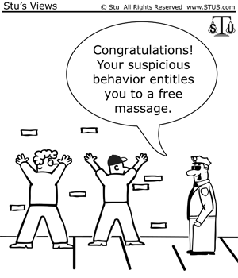

 

<h2> Motivation </h2>

Stop and Frisk has been a controversial police tactic used for years as a way to briefly stop and search civilians who are of suspect. Police must have "reasonable suspicion" according to the fourth amendment to legally stop a person. Utilizing NYC Stop and Frisk data, we want to develop a predictive model, visualize the data across the five New York City Boroughs, and describe the scope of our dataset.

<h2> Data Sources </h2>

Our data source, [Stop and Frisk Data](https://www1.nyc.gov/site/nypd/stats/reports-analysis/stopfrisk.page), is publicly available data from the NYPD. We used the data set published from 2016, due to its completeness within the data as well as its data dictionary. For future analysis, data can be acquired from from NYC's public database [additional data](https://opendata.cityofnewyork.us/) to explore neighborhood demographics. 

<h2> Questions </h2>

* Can we accurately predict if someone will be frisked or arrested after they have been stopped?

* How successful is the Stop and Frisk program?

* Are there trends over time of when stops occur?

* What does the geographic distribution of stops/frisks/arrests look like in NYC by precinct?
  + What are the leading reasons for stop and most common race stopped in each precinct?

<h2> Key Results </h2>

* After being stopped, using information about demographics, stop location, officer information, and reason for stop were not exceptionally useful for predicting frisk or arrest.

* Approximately 20% of stops do not lead to arrest.

* The frequency of stops decreased over 2016, less stops occur on Sunday and Monday compared to other days of the week, and most stops in a day occur during the evening/night.

* Take a look at our [map](https://group-13-final-proj.shinyapps.io/shiny_map/) to discover other results!

<h2> The Website </h2>

[Demographics Analysis](flexdashboard.html) : Exploratory plots highlighting demographic features broken down by people stopped, frisked, and arrested.

[Project Report](project_report.html) : The complete report with regression analysis along with additional analysis about minors only and stop trends over time.

[Map](https://group-13-final-proj.shinyapps.io/shiny_map/) : An interactive map of NYC to explore where stops, frisks, and arrests happened in NYC in 2016.

An overview of our website can be seen [here](https://vimeo.com/377632358).

<h4> Authors: Matthew Parker|Lauren Franks|Olya Besedina|Keyanna Davis|Clayton Snyder <h4> 

