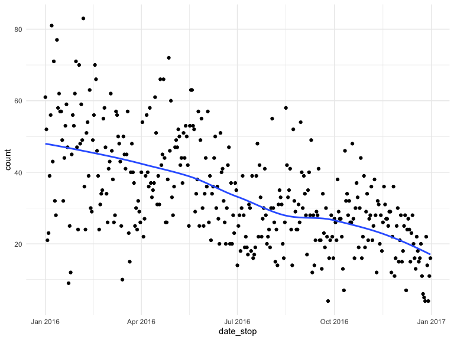
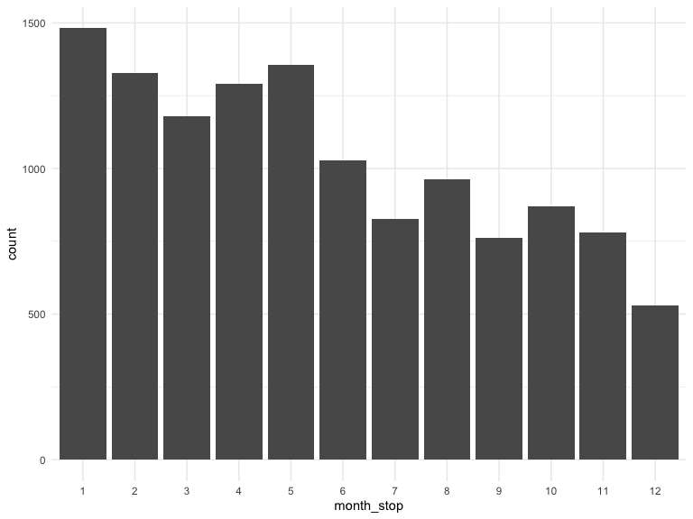
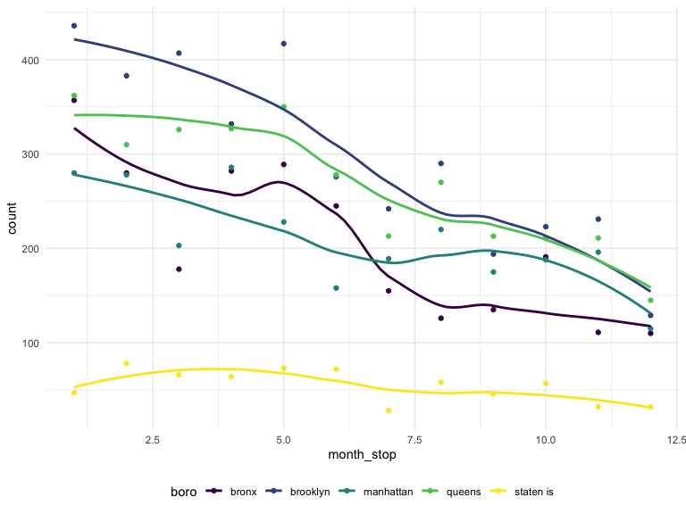
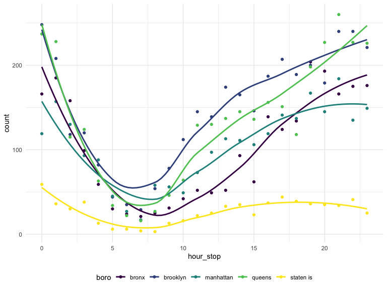
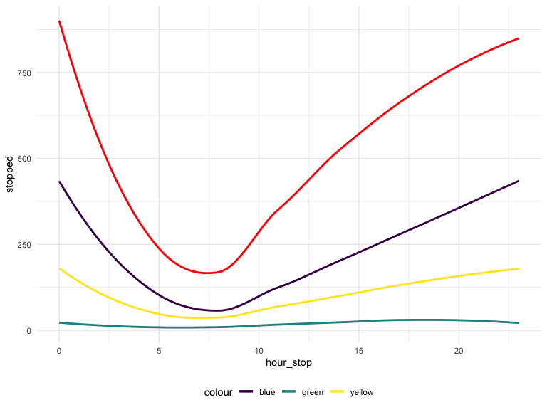

mp3745\_time\_analysis
================
mp3745
2019-11-24

Read in and tidy the data

The following code:

  - Reads in the data
  - Renames columns to be more informative
  - Combines height columns into a single height in inches
  - Converts date\_stop to date data type
  - Converts time\_stop to time data type
  - Recodes the values in categorical columns to be more informative
  - Selects column subset for further analysis
  - Removes the row of NAs that exists in the data

Looking at stops over time

  - Over a year
  - By time of day

<!-- end list -->

``` r
# Number of stops per day
stop_frisk_df %>% 
  group_by(date_stop) %>% 
  summarize(
    count = n()
  ) %>% 
  ggplot(aes(x = date_stop, y = count)) + 
  geom_point() +
  geom_smooth(se = FALSE)
```



``` r
# Number of stops per month
stop_frisk_df %>% 
  mutate(
    month_stop = factor(month(date_stop))
  ) %>% 
  filter(
    month_stop != is_null(month_stop)
  ) %>% 
  group_by(month_stop) %>% 
  summarize(
    count = n()
  ) %>% 
  ggplot(aes(x = month_stop, y = count)) + 
  geom_bar(stat = "Identity") 
```



``` r
# Number of stops per day (broken down by boro)
stop_frisk_df %>% 
  mutate(
    month_stop = month(date_stop)
  ) %>% 
  filter(
    month_stop != is_null(month_stop)
  ) %>%   
  group_by(month_stop, boro) %>% 
  summarize(
    count = n()
  ) %>% 
  ggplot(aes(x = month_stop, y = count, color = boro)) + 
  geom_point() +
  geom_smooth(se = FALSE) 
```



``` r
# Number of stops per hour over the day
stop_frisk_df %>% 
  mutate(
    hour_stop = hour(time_stop),
    part_of_day = cut(hour_stop, breaks = c(0, 5, 12, 17, 21, 24), labels = c("Night", "Morning", "Afternoon", "Evening", "Night"), right = FALSE)
  ) %>% 
  select(hour_stop, part_of_day) %>% 
  group_by(hour_stop, part_of_day) %>% 
  summarize(
    count = n()
  ) %>% 
  ggplot(aes(x = hour_stop, y = count)) + 
  geom_bar(stat = "Identity", aes(fill = part_of_day)) +
  geom_smooth(se = FALSE)
```


``` r
# Number of stops per hour over the day (broken down by boro)
stop_frisk_df %>% 
  mutate(
    hour_stop = hour(time_stop)
  ) %>% 
  group_by(hour_stop, boro) %>% 
  summarize(
    count = n()
  ) %>% 
  ggplot(aes(x = hour_stop, y = count, color = boro)) + 
  geom_point() +
  geom_smooth(se = FALSE)
```



This code chunk looks at the number of people stopped, frisked, frisked
& searched, and searched over a single day

``` r
stop_frisk_df %>% 
  filter(date_stop != is.na(date_stop)) %>% 
  mutate(
    hour_stop = hour(time_stop)
  ) %>% 
  group_by(hour_stop, frisked, searched) %>% 
  summarize(
    count = n()
  ) %>% 
  pivot_wider(
    names_from = frisked:searched,
    values_from = count
  ) %>% 
  rename(
    "stopped" = "0_0",
    "frisked" = "1_0",
    "searched" = "0_1",
    "frisk_and_search" = "1_1"
  ) %>% 
  mutate(
    searched = replace_na(searched, 0),
    stopped = replace_na(stopped, 0),
    frisked = replace_na(frisked, 0),
    frisk_and_search = replace_na(frisk_and_search, 0),
    stopped = stopped + searched + frisked + frisk_and_search
  ) %>% 
  ggplot(aes(x = hour_stop, y = stopped)) +
  geom_smooth(se = FALSE, color = 'red') +
  geom_smooth(aes(y = frisked, color = 'blue'), se = FALSE) +
  geom_smooth(aes(y = searched, color = 'green'), se = FALSE) +
  geom_smooth(aes(y = frisk_and_search, color = 'yellow'), se = FALSE) 
```



Animated

``` r
# Number of stops per hour over the day (broken down by boro)
stop_frisk_df %>% 
  mutate(
    hour_stop = hour(time_stop)
  ) %>% 
  group_by(hour_stop, boro) %>% 
  summarize(
    count = n()
  ) %>% 
  ggplot(aes(x = hour_stop, y = count, color = boro)) + 
  geom_point() +
  geom_smooth(se = FALSE) +
  transition_states(
    boro,
    transition_length = 2,
    state_length = 1
  ) +
  enter_fade() +
  exit_shrink() +
  ease_aes('sine-in-out')
```

    ## NULL
